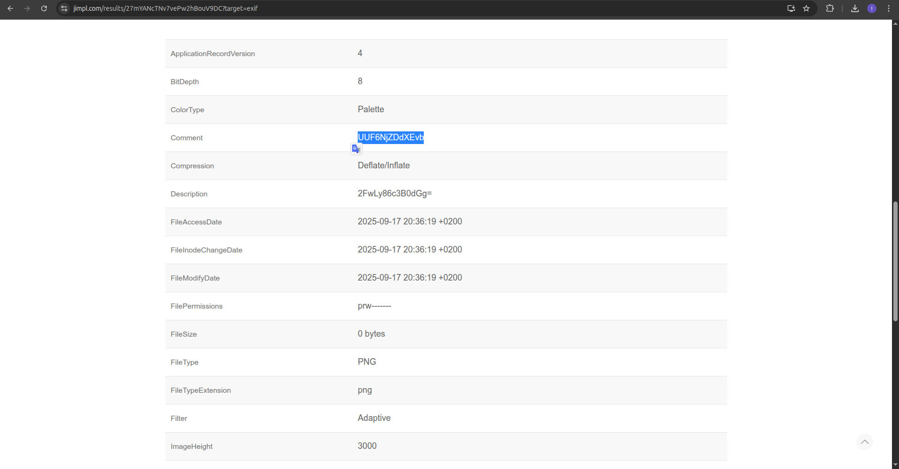
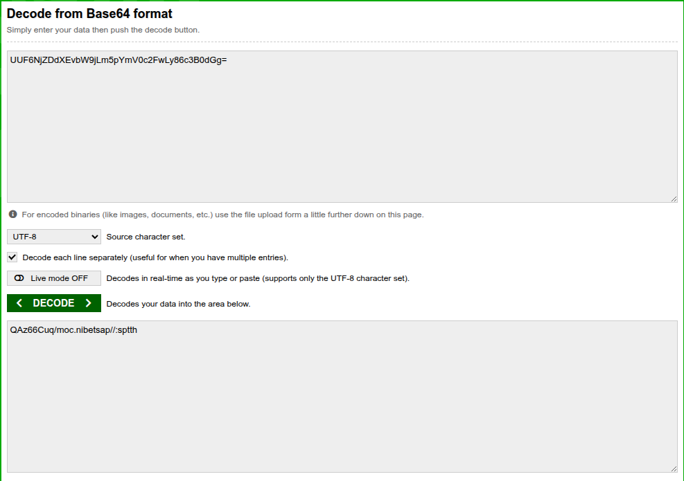
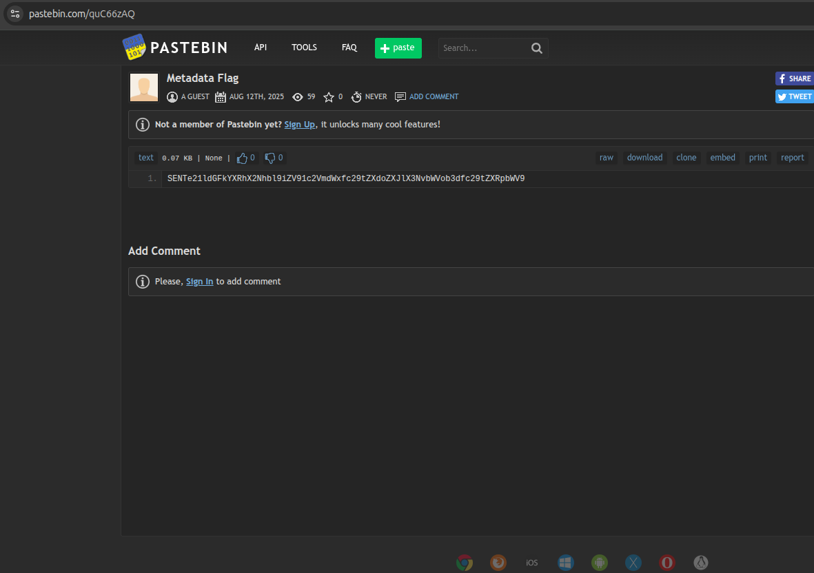
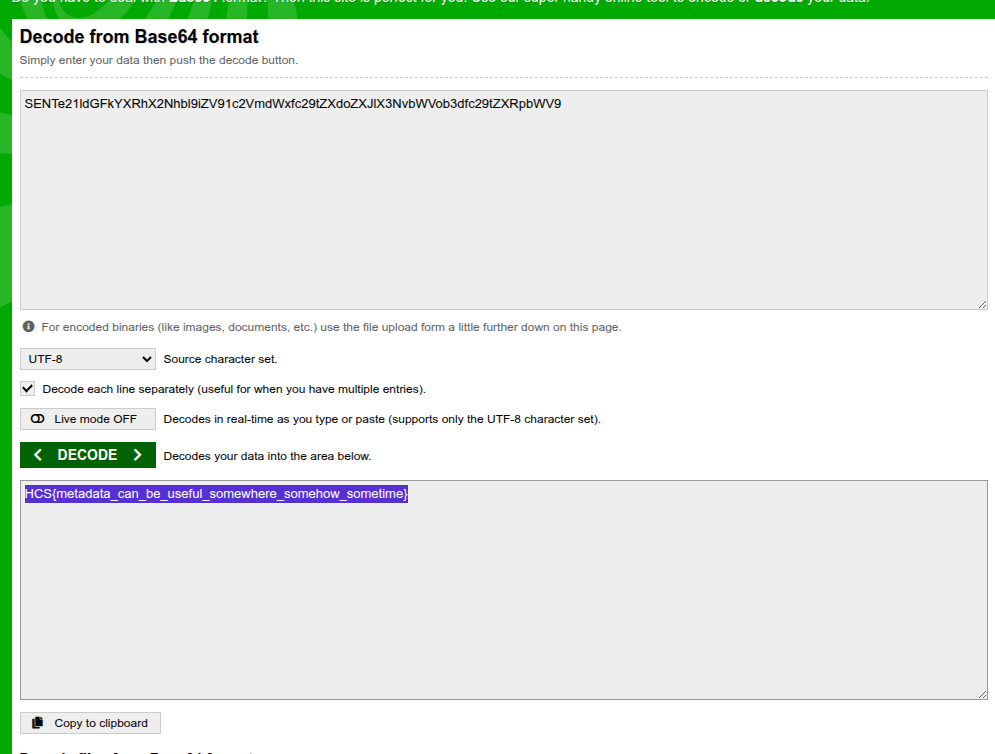

# Atadatem

## Description

look there are data that seperated!! you should combine them!

## Solution

We are given a image file `hcs.png`. From the title i can assume some data is hidden in the metadata section of the image. Using online exif viewer, we can see three seemingly random strings in the metadata section.

Comment: `UUF6NjZDdXEvb`

Description: `2FwLy86c3B0dGg=`

Keywords: `W9jLm5pYmV0cm9zLmNvbQ`

I assumed these strings are base64 encoded, so i decoded them and got a pastebin link: `QAz66Cuq/moc.nibetsap//:sptth`. Reversing the string gives us a valid pastebin link: `https://pastebin.com/quC66zAQ`.

Upon visiting the link, i got an encoded by maybe base64 again string: `SENTe21ldGFkYXRhX2Nhbl9iZV91c2VmdWxfc29tZXdoZXJlX3NvbWVob3dfc29tZXRpbWV9`. Decoding it gives us the flag: `HCS{metadata_can_be_useful_somewhere_somehow_sometime}`

