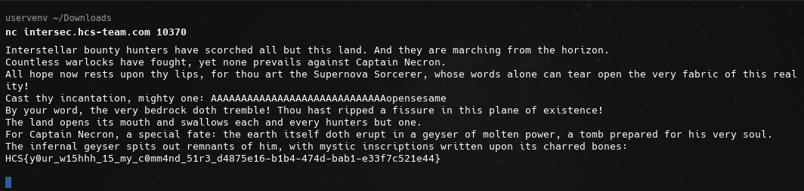

# Cosmic Tongue

## Description

Waiter, waiter! cast a meteor on this person NOW!

## Solution

So i dissassembled the binary and found the correct offset to run the `opensesame` functon. I calculated the offset like this:

```text
Distance = (Address of key) - (Address of message)
Distance = (RBP - 19) - (RBP - 48)
Distance = -19 - (-48)
Distance = -19 + 48
Distance = 29 bytes
```

Then i entered `AAAAAAAAAAAAAAAAAAAAAAAAAAAAAopensesame` in the input and got the flag

This is the flag: `HCS{y0ur_w15hhh_15_my_c0mm4nd_51r3_d4875e16-b1b4-474d-bab1-e33f7c521e44}`


