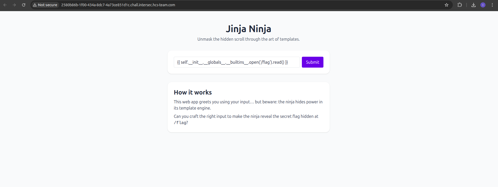
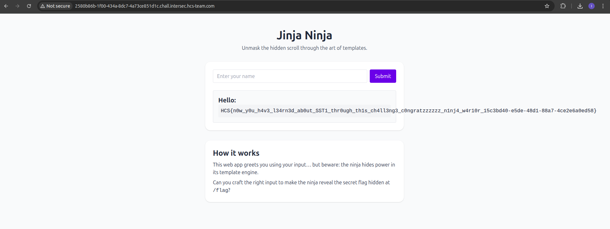

# Jinja Ninja

## Description

WTF is a JINJA? Aint it supposed to be NINJA RAHHHHHHHH

## Solution

We are given a link to a web application. Upon visiting the link, we see a simple web page with a form that takes input and displays it back to the user. This web application is vulnerable to Server-Side Template Injection (SSTI) using the Jinja template engine.

To exploit this vulnerability, we can inject Jinja template syntax into the input field. This is the code to access `/flag.txt` file

`{{ self.__init__.__globals__.__builtins__.open('/flag').read() }}`

Before injection:

After injection:

This is the flag: `HCS{n0w_y0u_h4v3_l34rn3d_ab0ut_SST1_thr0ugh_th1s_ch4ll3ng3_c0ngratzzzzzz_n1nj4_w4r10r_15c3bd40-e5de-48d1-88a7-4ce2e6a0ed58}`
