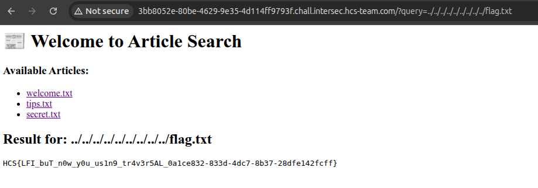

# LeFI Gimang

## Description

LeFi is an attack technique in which attackers trick a web application into either running or exposing files on a web server.

## Solution

In this challenge, we are given a URL to a web application. The application has a file traversal vulnerability that allows us to read arbitrary files on the server. By exploiting this vulnerability, we can access sensitive files and potentially find the flag. We can use LFI (Local File Inclusion) to read files on the server.

The server does not use any authentication mechanism, so we can directly access the file traversal vulnerability.

By manipulating `?query=` parameter, we can read files on the server. To read the `/flag.txt` file, we can use file traversal techniques such as `../../../../../../../../../flag.txt` to read the file

The flag is: `HCS{LFI_buT_n0w_y0u_us1n9_tr4v3r5AL_0a1ce832-833d-4dc7-8b37-28dfe142fcff}`
