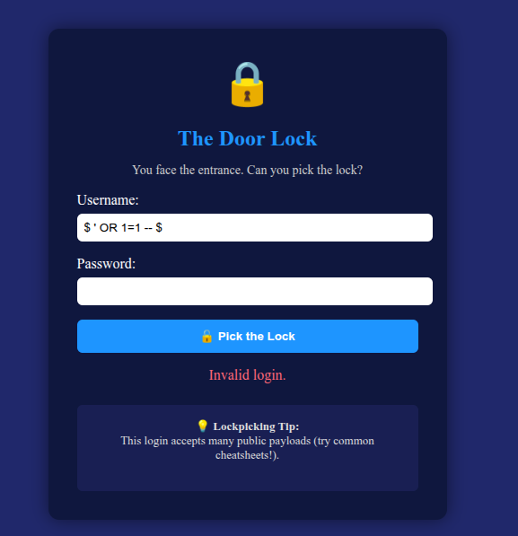
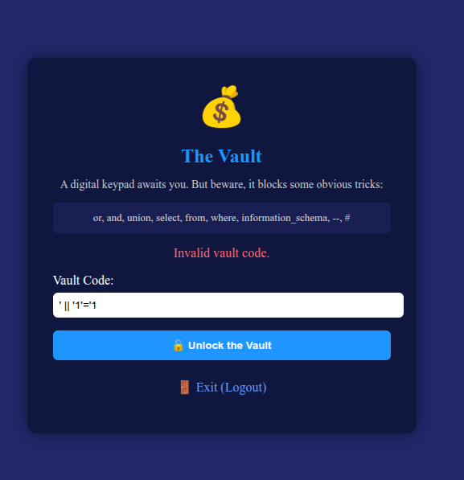
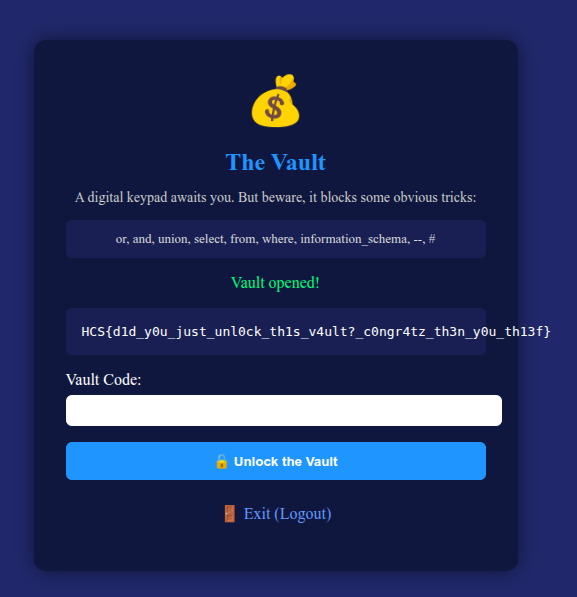

# Lockpicking

## Description

I just made a vault to store my treasured things, it should be very secure right?

## Solution

The input field in this can be exploited using SQL Injection. The payload used is:

`$ ' OR 1=1 -- $`

This payload effectively bypasses the authentication mechanism by making the condition always true, allowing access to the system

Then there is a second authentication step that cannot use `or, and, union, select, from, where, information_schema, --, #`. So we can use this payload:

` ' || '1'='1 `

Then this is the flag: `HCS{d1d_y0u_just_unl0ck_th1s_v4ult?_c0ngr4tz_th3n_y0u_th13f}`

