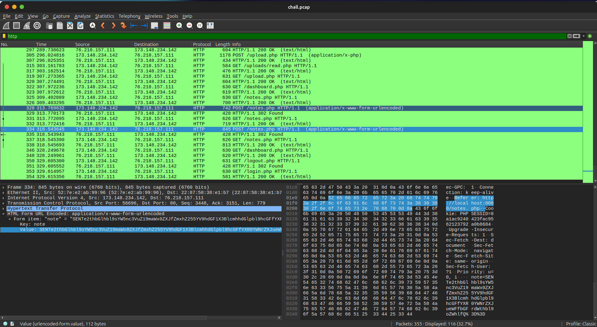
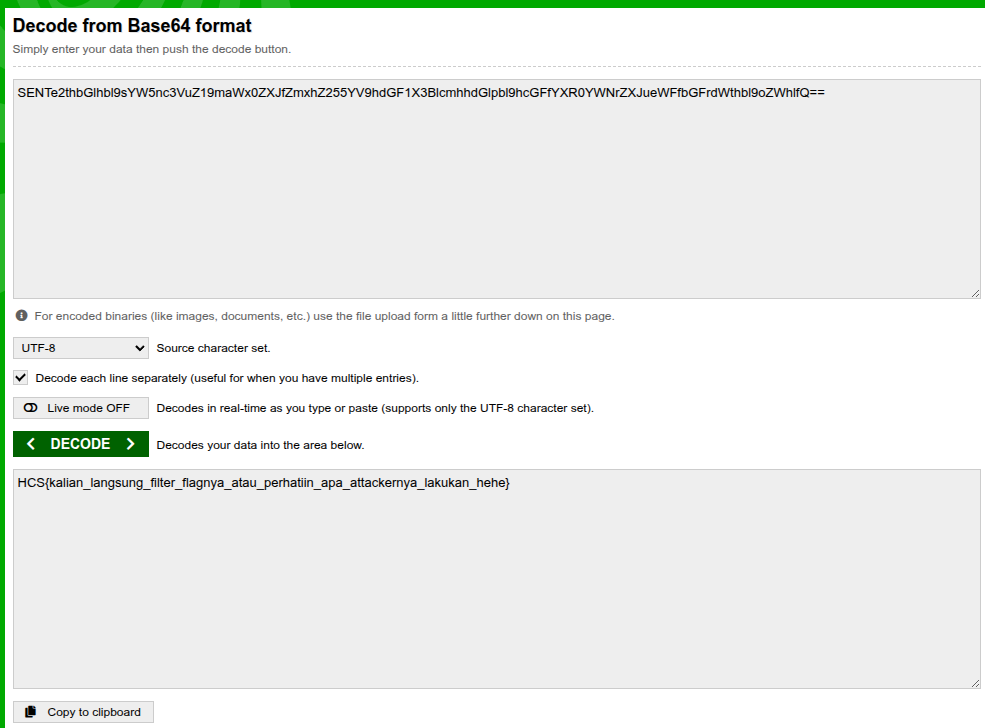

# My Networ(th)k

## Description

## Solution

This challenge provides a pcap file that contains network traffic. By analyzing the pcap file using Wireshark, we can filter the traffic to find any interesting information. From the pcap file, i saw some HTTP traffic that contains some random encoded stuff so i then tried to decode it using bas64 then i got a flag.

The flag is: `HCS{kalian_langsung_filter_flagnya_atau_perhatiin_apa_attackernya_lakukan_hehe}`
