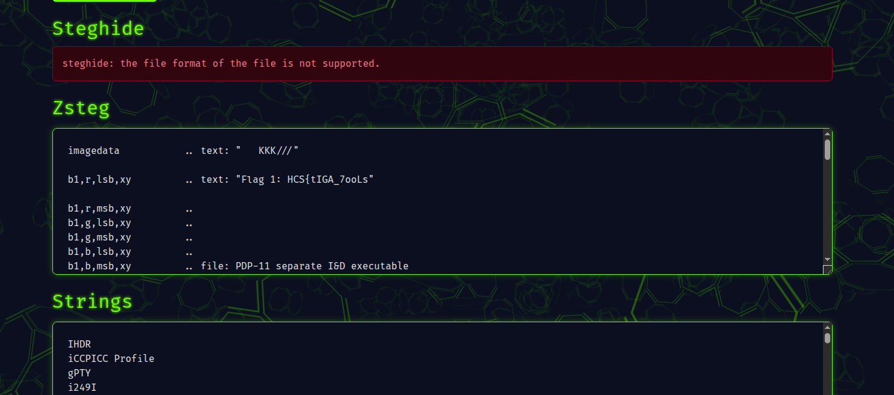

# Three Umazing Things

## Description

To Solve this you need three umazing tools to get the flag. Good Luck!

## Solution

Upon donwloading the provided file, we got 1 png file and 2 jpg files. So i asked ChatGPT to help me know what to do with these files. So the GPT suggested me to use stegseek, binwalk, and zsteg. So i tried all of them with three of this files and i got the flag from all three files.

Using online `zsteg` i got part 1 of the flag from `sedihakuwak.png`: `HCS{tIGA_7ooLs`

Then using `stegseek ./grrrr.jpg ./rockyou.txt` i got part 2 of the flag: `_9a_t3rlalu_5u$Ah`

Using `binwalk -e ./hehe.jpg` i then got a txt file which contains part 3 of the flag: `_K@N_yaK_a0k@W@OWK}`

So the final flag is: `HCS{tIGA_7ooLs_9a_t3rlalu_5u$Ah_K@N_yaK_a0k@W@OWK}`
