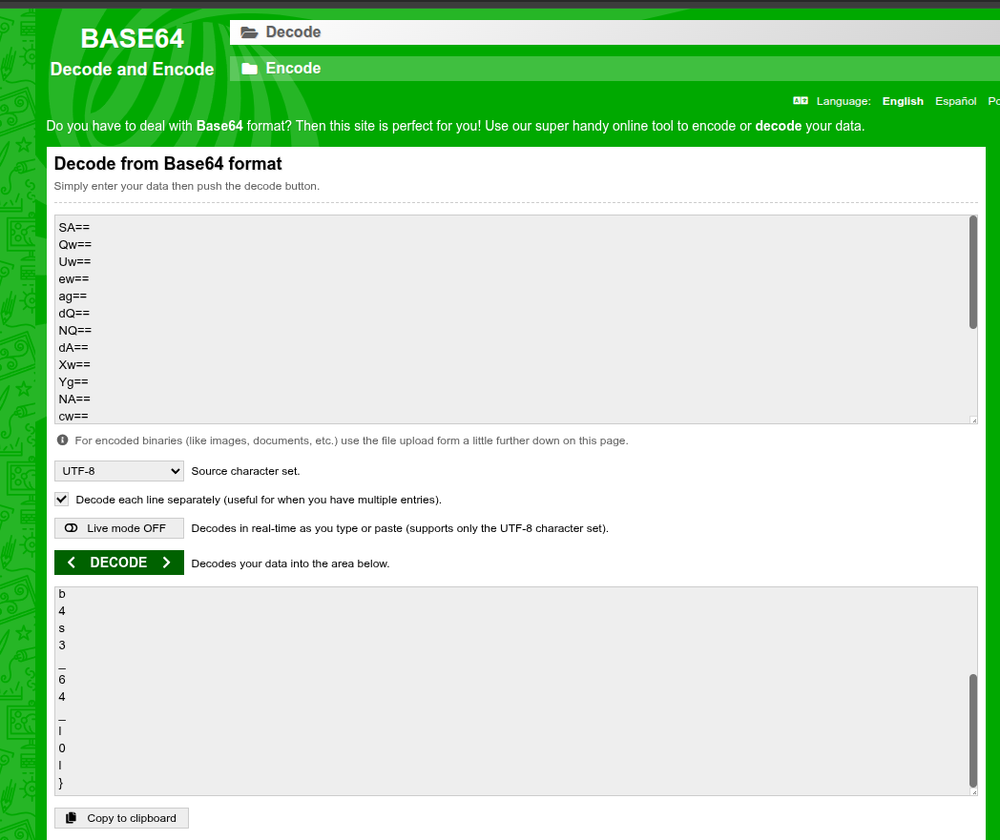

# based

## Description

They didn’t hide the flag… they just buried it alive.

## Solution

From the challenge description, we can assume that the flag is hidden using base64 encoding. The hint "buried it alive" suggests that the flag might be encoded multiple times. So i just decode it multiple times until i get the flag. But after several decodes i found this seemingly repeating pattern:

`SA==Qw==Uw==ew==ag==dQ==NQ==dA==Xw==Yg==NA==cw==Mw==Xw==Ng==NA==Xw==bA==MA==bA==fQ==`

This looks like base64 encoded strings separated by `==`. So i split the string by `==` and decode each part individually. After decoding each part, I concatenate the results to get the final flag.

The final flag is: `HCS{ju5t_b4s3_64_l0l}`

