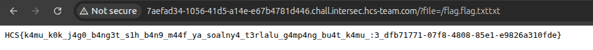

# elefay

## Description

Flag file in `/flag.txt`

## Solution

This is a simple web challenge. The main goal is to read the content of the `/flag.txt` file. We can use LFI vulnerability to read the file. But the server has a code that prevents us from reading the file, this is the code: `preg_replace('/flag\.txt/i', '', preg_replace('/\.\.\//', '', $_GET['file']))`. We cannot type `?file=/flag.txt` directly because the server will remove `flag.txt` from our input. We can bypass this by using this payload:

`?file=/flag.flag.txttxt`

This payload effectively bypass the filter and reads the content of the `/flag.txt` file, allowing us to retrieve the flag.

The flag is: `HCS{k4mu_k0k_j4g0_b4ng3t_s1h_b4n9_m44f_ya_soalny4_t3rlalu_g4mp4ng_bu4t_k4mu_:3_dfb71771-07f8-4808-85e1-e9826a310fde}`
