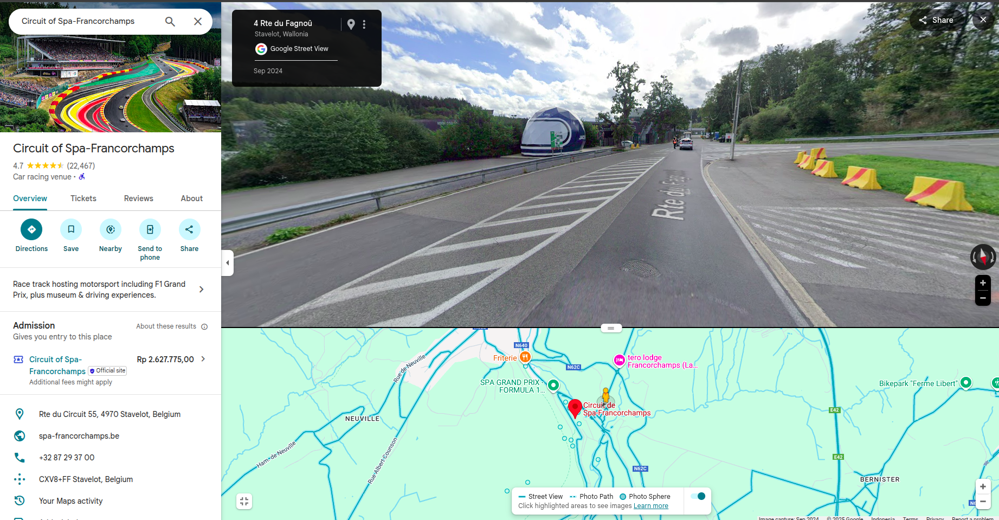
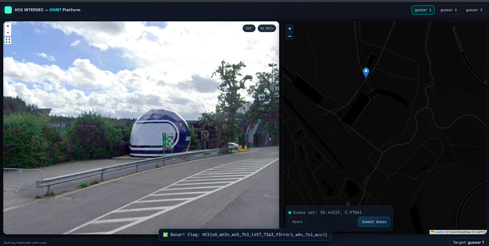

# guessr 1

## Description

"must be the ~~wind~~ water."

## Solution

This challenge is about identifying locations from images. The first image shows a blue helmet as a landmark. So i just screenshot the landmark and search it on google images and got Circuit de Spa-Francorchamps in Belgium.

Then i search for the location on google maps near Circuit de Spa-Francorchamps and found the exact location

And i click the location on the ctf website and got the flag. The flag is: `HCS{s0_wh3n_w45_7h3_l457_71m3_f3rr4r1_w0n_7h3_wcc?}`

