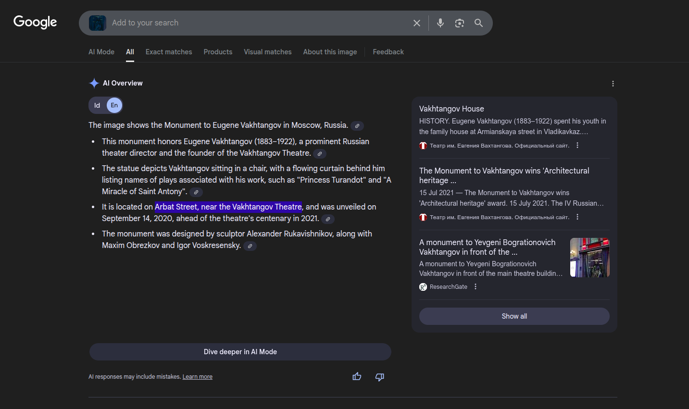
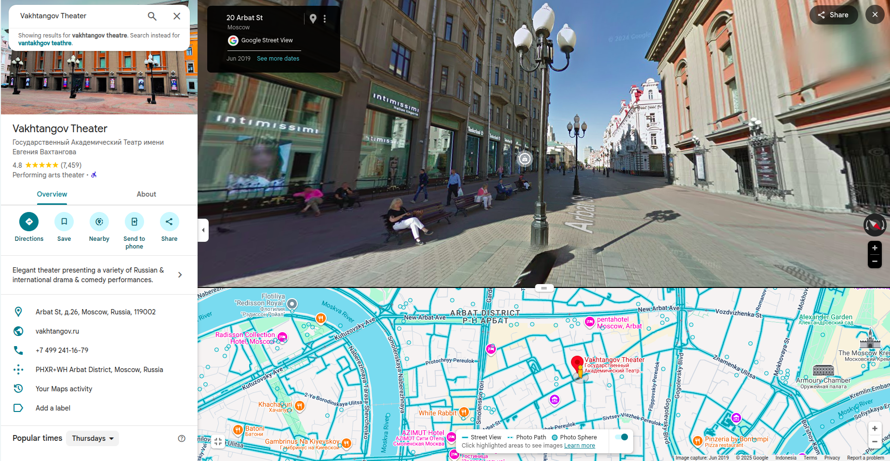
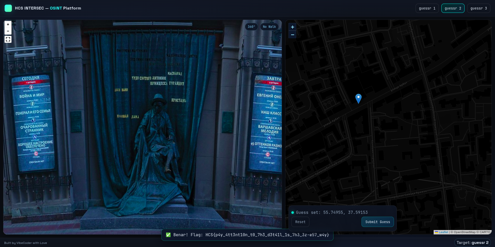

# guessr 2

## Description

i dont understand the local language and lost my friend on the way. can you find out where i'm so my friend can pick me up?

## Solution

This challenge is about identifying locations from images. The second image shows a statue as a landmark. So i just screenshot the landmark and search it on google images and got Vakhtangov theatre in Arbat Street.

Then i search for the location on google maps near Vakhtangov theatre and found the exact location

And i click the location on the ctf website and got the flag. The flag is: `HCS{p4y_4tt3nt10n_t0_7h3_d3t41l_1s_7h3_3z-e57_w4y}`

