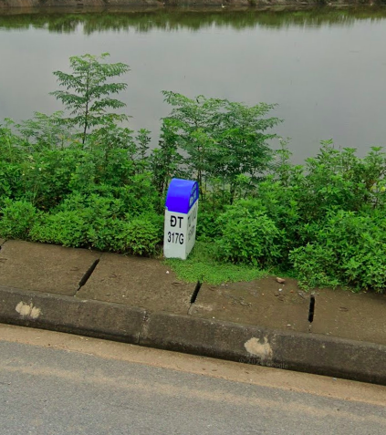
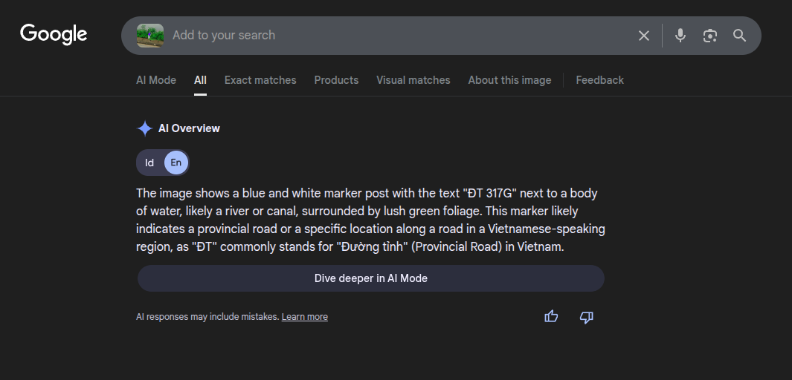
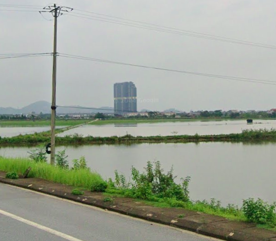
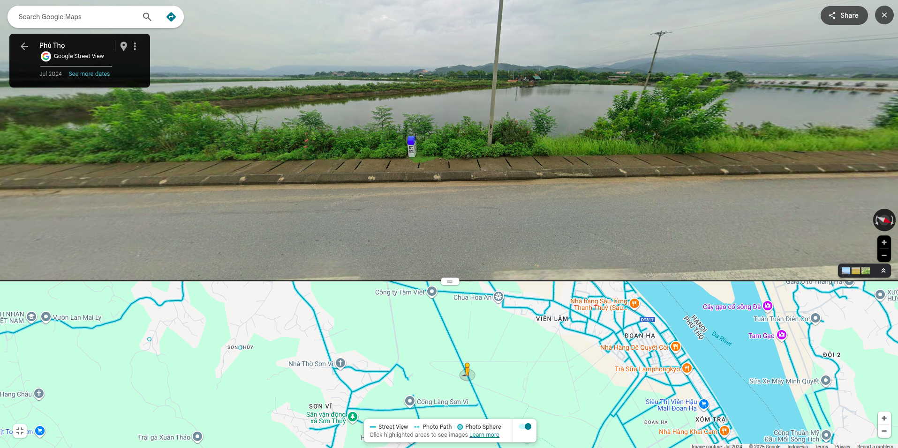
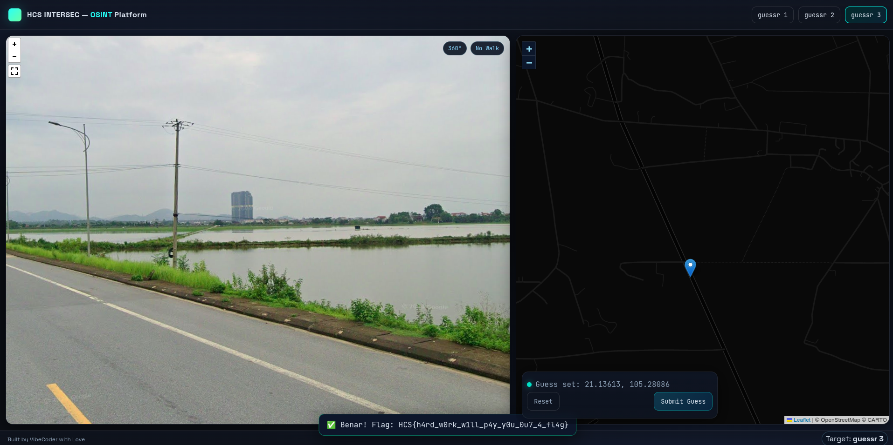

# guessr 3

## Description

can you find out where this is before gta 6 released?

## Solution

This challenge is about identifying locations from images. The third image shows a road signs as a landmark. So i just screenshot the landmark and search it on google images

The Google AI Overview said the image location could be in Duong Tinh road D317

Then i search for the location on google maps near Duong Tinh road D317 and found the exact location with the help of a large building as the second landmark

And i click the location on the ctf website and got the flag. The flag is: `HCS{h4rd_w0rk_w1ll_p4y_y0u_0u7_4_fl4g}`

