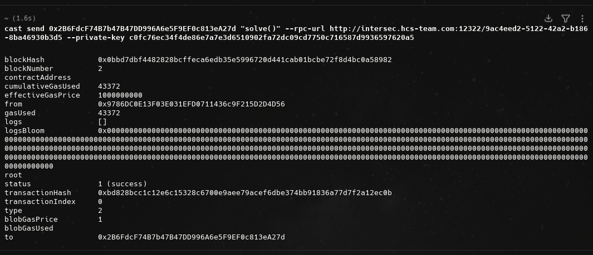
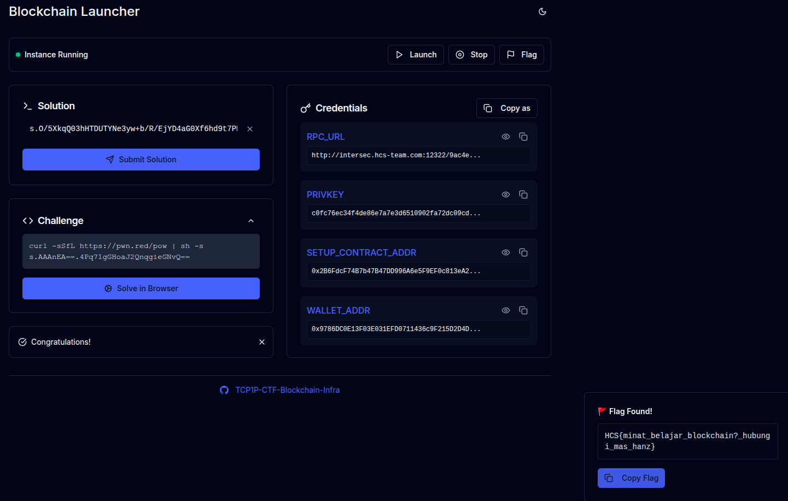

# toggle

## Description

Maw flag

## Solution

So i asked ChatGPT whats with the blockchain stuff. And i gave ChatGPT screenshot of the website. And it told me to do the curl first and submit the solution

After that i've been told by ChatGPT to install `foundry` and run 

``` bash
cast send 0x2B6FdcF74B7b47B47DD996A6e5F9EF0c813eA27d "solve()" --rpc-url http://intersec.hcs-team.com:12322/9ac4eed2-5122-42a2-b186-8ba46930b3d5 --private-key c0fc76ec34f4de86e7a7e3d6510902fa72dc09cd7750c716587d9936597620a5
```

So i did that and got the flag: `HCS{minat_belajar_blockchain?_hubungi_mas_hanz}`




